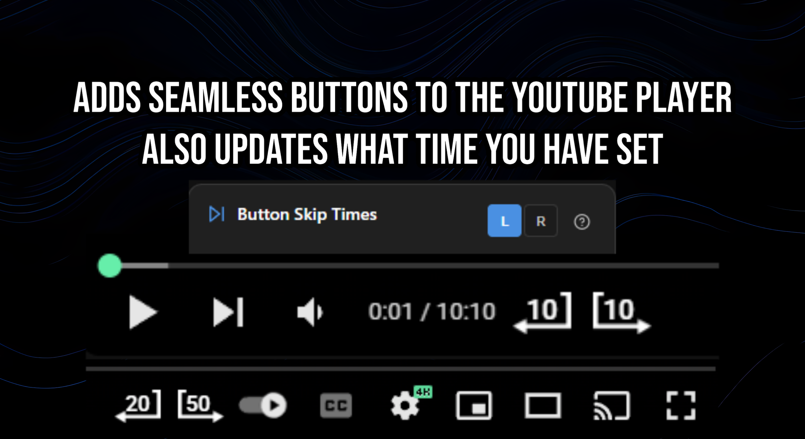
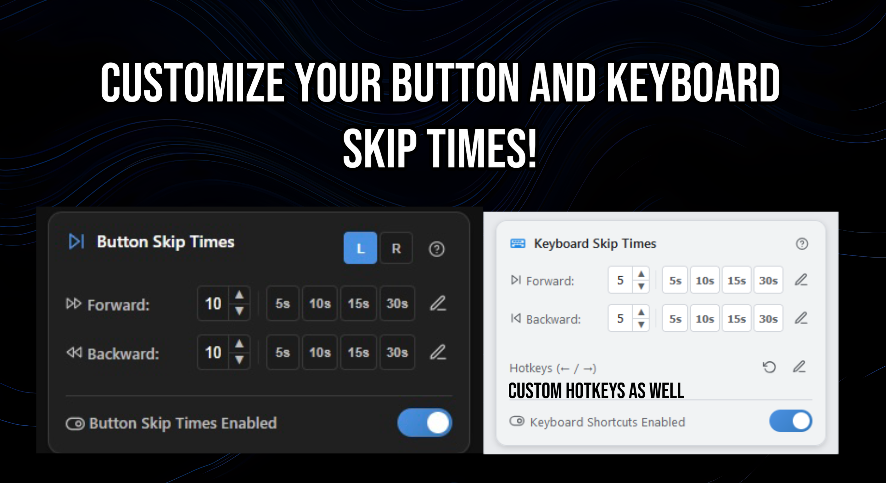
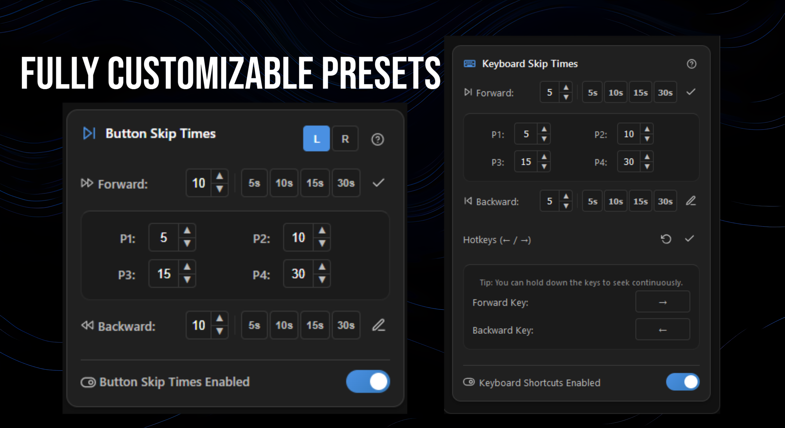
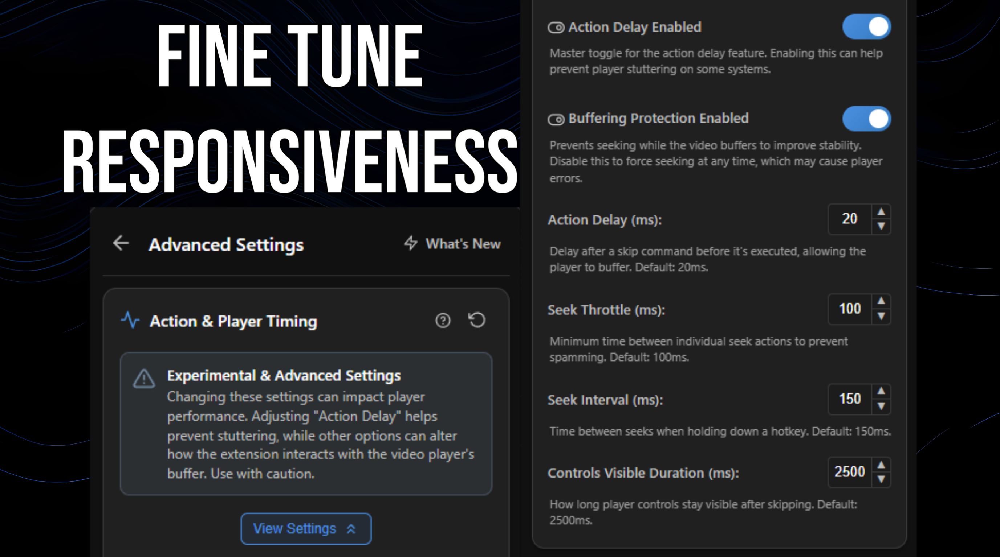

  
  
  
  
  
  

  <h1>YouTube Fast Forward & Rewind</h1>
  
Take full control of your YouTube playback with customizable skip buttons, keyboard shortcuts, and advanced settings.

<table width="80%">
  <thead>
    <tr>
      <th align="center" width="50%">Firefox</th>
      <th align="center" width="50%">Google Chrome</th>
    </tr>
  </thead>
  <tbody>
    <tr>
      <td align="center" valign="top">
        <a href="https://addons.mozilla.org/en-US/firefox/addon/youtube-fast-forward-rewind/">
          
           
          <strong>Install from Firefox Add-ons</strong>
        </a>
          
        <small><em>Actively maintained.</em></small>
      </td>
      <td align="center" valign="top">
        <a href="https://chromewebstore.google.com/detail/youtube-fast-forward-rewi/bkhjomondpmkjohilihdldfjmhpgkhcm?authuser=0&hl=en">
          
           
          <strong>Install from Chrome Web Store</strong>
        </a>
          
        <small><em>Actively maintained.</em></small>
      </td>
    </tr>
  </tbody>
</table>

 

## Key Features

-   **Customizable Skip Times & Presets**
    -   Set your own fast forward and rewind times for both the on-screen buttons and keyboard shortcuts.
    -   Configure up to 4 quick-select presets for each action, accessible from a clean, collapsible editor.

-   **Fully Customizable Hotkeys**
    -   Override YouTube's defaults and assign any key you want for skipping forward and backward.
    -   Includes a "Reset to Default" option to quickly restore the arrow keys.

-   **Advanced Controls**
    -   Fine-tune player responsiveness with an experimental "Action Delay" setting, perfect for preventing buffering on slower connections.

-   **Seamless Integration**
    -   The buttons are designed to fit perfectly into YouTube's native player interface.

-   **Auto-Save**
    -   All your custom settings are saved automatically.

## Gallery

  

 

  

 

  

 

  

