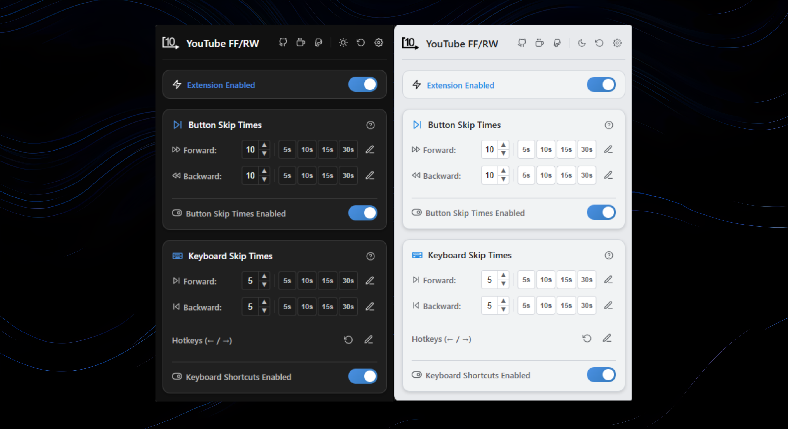
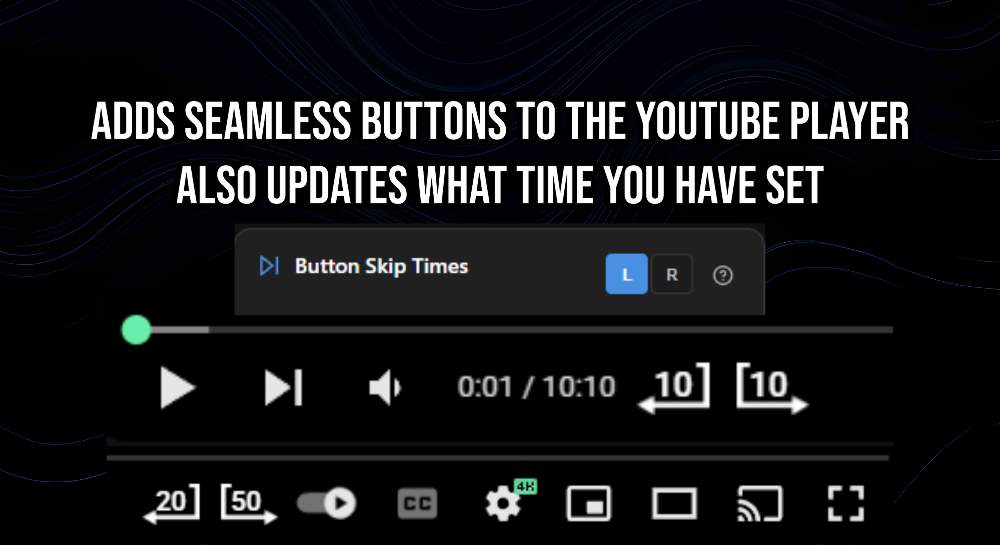
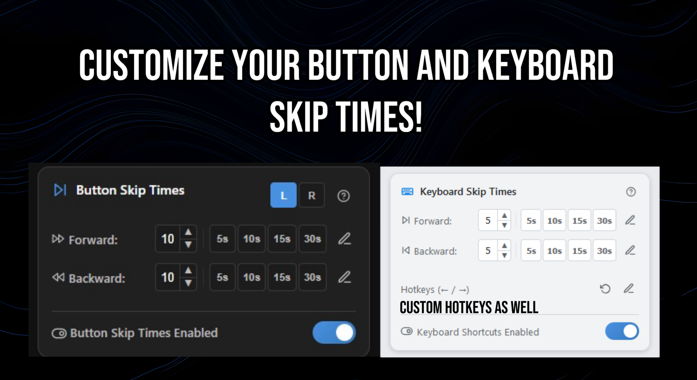
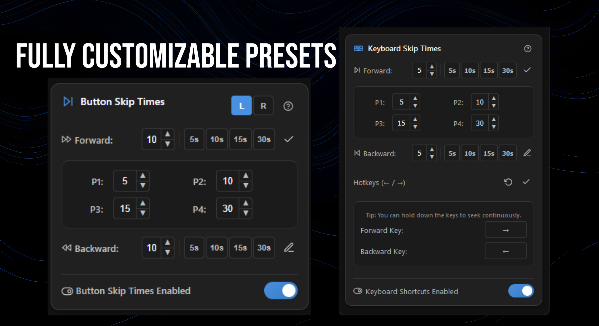
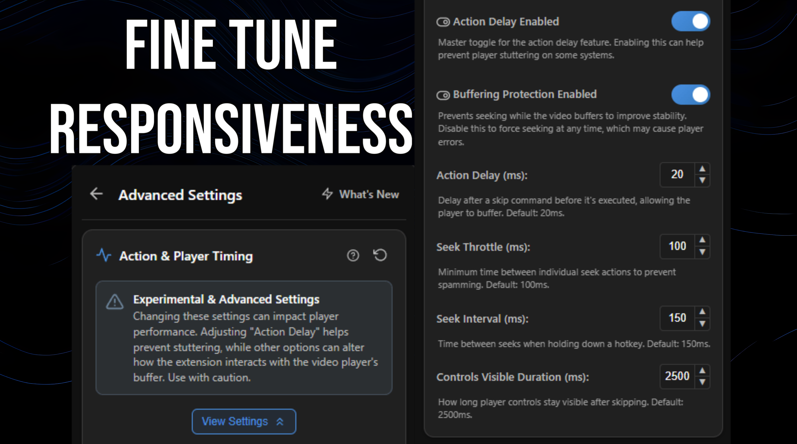

<p align="center">
  <a href="https://github.com/Laskco/YouTube-Fast-Forward-and-Rewind/commits/main"></a>
  <a href="https://github.com/Laskco/YouTube-Fast-Forward-and-Rewind/issues"></a>
  <a href="https://addons.mozilla.org/en-US/firefox/addon/youtube-fast-forward-rewind/"></a>
  <a href="https://chromewebstore.google.com/detail/youtube-fast-forward-rewi/bkhjomondpmkjohilihdldfjmhpgkhcm"></a>
  <a href="https://addons.mozilla.org/en-US/firefox/addon/youtube-fast-forward-rewind/"></a>
  <a href="https://chromewebstore.google.com/detail/youtube-fast-forward-rewi/bkhjomondpmkjohilihdldfjmhpgkhcm"></a>
</p>

<div align="center">
  <h1>
    YouTube Fast Forward & Rewind
    
  </h1>
  <p>Take full control of your YouTube playback with customizable skip buttons, keyboard shortcuts, and advanced settings.</p>
</div>

<div align="center">
  <a href="https://addons.mozilla.org/en-US/firefox/addon/youtube-fast-forward-rewind/"></a>&nbsp;&nbsp;&nbsp;<a href="https://chromewebstore.google.com/detail/youtube-fast-forward-rewi/bkhjomondpmkjohilihdldfjmhpgkhcm"></a>
</div>

---

<p align="center">
  
</p>

---

## Key Features

- **Custom skip controls:** Choose independent forward and rewind times for player buttons and keyboard shortcuts.
- **Quick presets:** Configure four reusable presets for every button and keyboard direction.
- **Press and hold:** Hold a player button or keyboard shortcut for continuous seeking with adjustable timing.
- **Accessible player integration:** Native buttons include keyboard activation, visible focus states, labels, and reduced-motion support.
- **Buffering protection:** Pause repeated seeks while the video is buffering, or turn the protection off when desired.
- **Reliable YouTube navigation:** Controls recover automatically as YouTube replaces its player during in-page navigation.
- **Local statistics:** See total time skipped and a button-versus-keyboard breakdown.
- **Synchronized preferences:** Playback preferences follow the browser profile while statistics and diagnostics stay local.
- **Dark and light themes:** The popup supports both themes and remembers the selection.

---

## Gallery

<div align="center">
<table>
  <tr>
    <td align="center" valign="top">
      
    </td>
    <td align="center" valign="top">
      
    </td>
  </tr>
  <tr>
    <td align="center" valign="top">
      
    </td>
    <td align="center" valign="top">
      
    </td>
  </tr>
</table>
</div>

---

## Privacy and Permissions

The extension does not collect or transmit personal data to the developer. It requests only browser storage and access to YouTube pages:

- Playback preferences are stored with the browser's synchronized extension storage.
- Skip statistics, popup state, and the ten most recent diagnostic errors are stored locally on the device.
- YouTube page access is used only to add and operate the player controls.

## Build from Source

### Requirements

- [Node.js](https://nodejs.org/) 22 or newer
- npm, which is included with Node.js

Clone the repository, install the locked dependencies, run the complete validation suite, and create both browser builds:

```sh
git clone https://github.com/Laskco/YouTube-Fast-Forward-and-Rewind.git
cd YouTube-Fast-Forward-and-Rewind
npm ci
npm run check
npm run build
```

The commands produce:

- `dist/chrome` — the unpacked Chrome Manifest V3 build.
- `dist/firefox` — the unpacked Firefox Manifest V3 build.

Each build contains only the background declaration supported by that browser. Running `npm run build` deletes and recreates both output directories, so generated files should never be edited directly.

### Validation

`npm run check` runs the JavaScript, HTML, CSS, dead-code, duplicate-code, security, Firefox extension, and automated test checks. Run it before submitting a change or packaging a release.

Individual commands are also available:

```sh
npm run lint
npm run test
```

### Test the unpacked builds

1. Chrome: open `chrome://extensions`, enable **Developer mode**, select **Load unpacked**, and choose `dist/chrome`.
2. Firefox: open `about:debugging#/runtime/this-firefox`, select **Load Temporary Add-on**, and choose `dist/firefox/manifest.json`.

Reload an already-open YouTube tab after installing or rebuilding the extension.

The supported baseline is Chrome 111+, Firefox Desktop 140+, and Firefox for Android 142+.

---

## Contributing

Contributions, issues, and feature requests are welcome! Feel free to check the [issues page](https://github.com/Laskco/YouTube-Fast-Forward-and-Rewind/issues).

---
